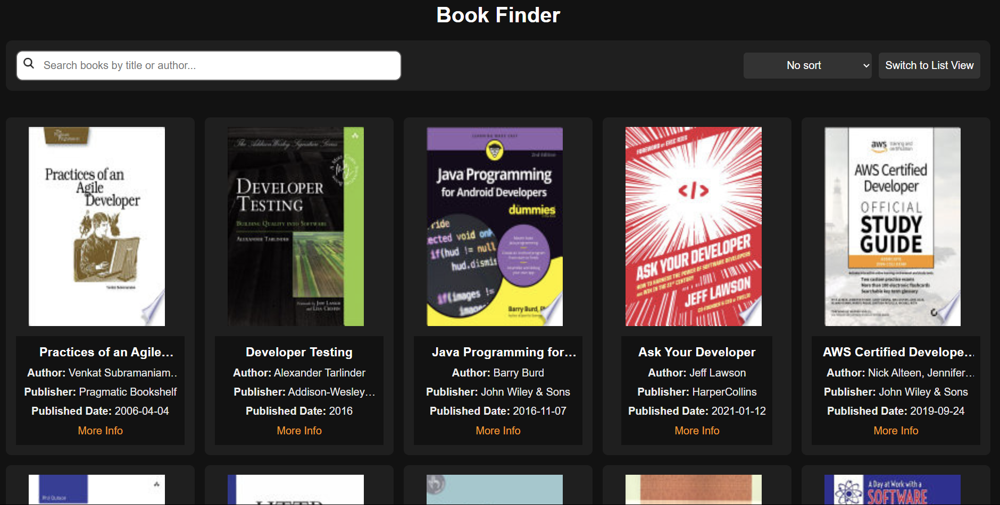
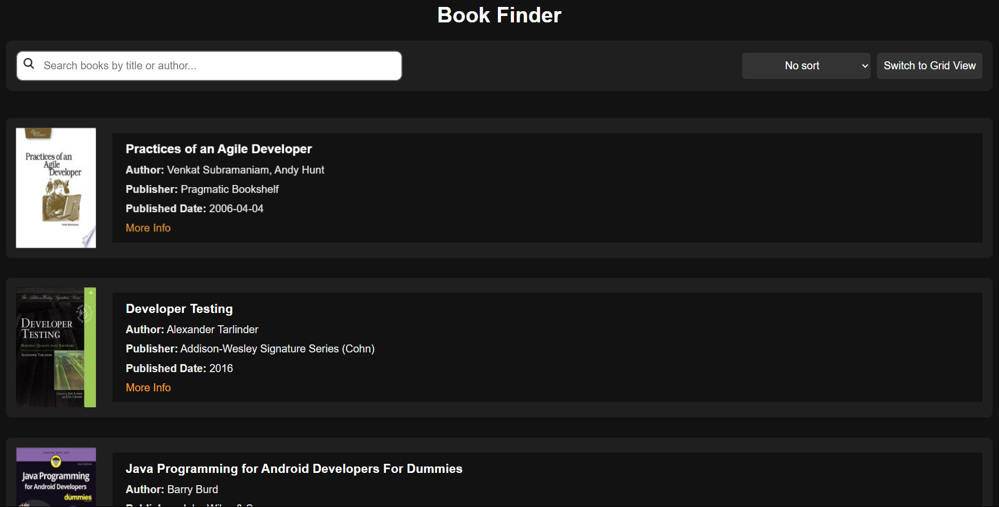
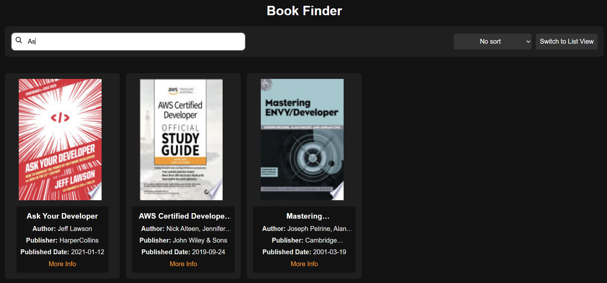

# 📚 Book Finder

## 🌟 Overview
A simple **Book Finder** site that fetches books from an API and displays them in a **List/Grid format**. Users can **search, sort, toggle views, and load more books** dynamically. The app is fully **responsive, animated, and user-friendly**.


🔗 **Live URL:** [FindMyBooks](https://book-finder-gilt-sigma.vercel.app/)  
🔗 **GitHub Repository:** [Books-Listing-WebPage](https://github.com/Amarsah15/Book-Finder)

---

## ✨ Features
- 🔎 **Search Books** - Instantly search for books by title or author.
- 📑 **Sort Options** - Sort books by name or publication date.
- 📖 **List/Grid View** - Toggle between list and grid layout.
- 🚀 **Fast & Responsive** - Works on all devices seamlessly.
- ➕ **Load More** button to fetch **10 more books at a time**.
- 📌 **New books are added on top of previous ones** instead of infinite scrolling.

---

## 🛠️ Tech Stack
- **HTML** - Structuring the webpage.
- **CSS** - Styling and layout.
- **JavaScript** - Fetching API data and handling interactivity.

---

## 📂 Project Structure
```
📦 Books-Listing-WebPage
├── 📄 index.html       # Main HTML file
├── 📜 script.js        # JavaScript logic for fetching and displaying books
├── 🎨 styles.css       # Stylesheet for UI design
├── 📂 ass/images       # Folder for icons and images
```

---

## 🚀 Getting Started
### 🔧 Installation & Setup
1. Clone the repository:
   ```bash
   git clone https://github.com/Amarsah15/Book-Finder.git
   ```
2. Navigate to the project folder:
   ```bash
   cd Book_Finder
   ```
3. Open `index.html` in a browser:
   ```bash
   open index.html
   ```

---

## 📜 Usage
- Search for books using the search bar.
- Sort books by title or release date.
- Toggle View between List/Grid.
- Click "Load More" to fetch more books.
- Click on a book to open more details in a new tab.

---

## 🖼️ Screenshots
### 🎨 Grid View


### 📃 List View


### 🔎 Searching for Books


---

## 🏆 Contributing
Contributions are welcome! Feel free to fork the repo and submit a pull request.

---

## 📄 License
This project is licensed under the MIT License.

---

⭐ Show Some Love!
If you found this useful, give it a star ⭐ on GitHub!